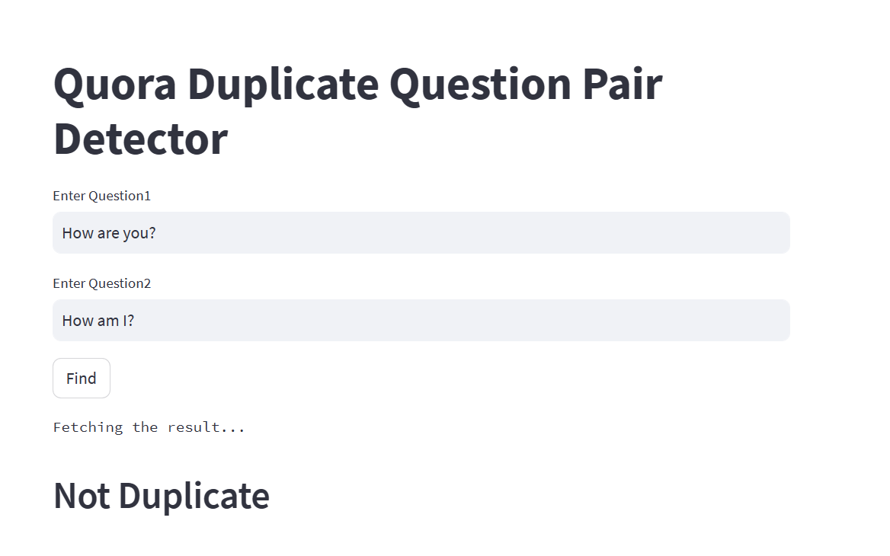

The objective of Quora duplicate question pair detection project is to identify pairs of questions that are essentially asking the same thing. This can be done by using natural language processing techniques to extract features from the questions that can be used to measure their similarity. Once a pair of questions has been identified as duplicate, they can be merged together so that users only see one version of the question.